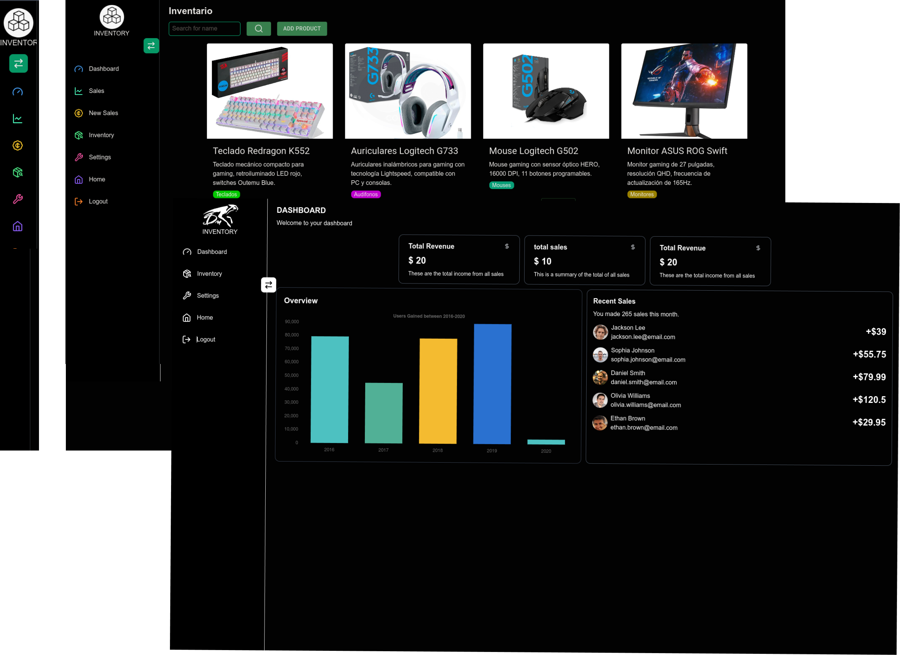

# Frontend for proyect inventory

<div style="display: flex; justify-content: center;">
  
</div>

## Preview


## Modules

- Users
- Iventory
- Sashboard
- Sales

## Used technology

- TypeScript
- React whidt Vite
- Material Ui
- Tailwind css
- react-chartjs-
- react-redux

## Installation
```bash
git clone https://github.com/Duberly2004/inventory_frontend
```
```bash
cd inventory_frontend
```
```bash
npm install 
```
```bash
npm run dev 
```
